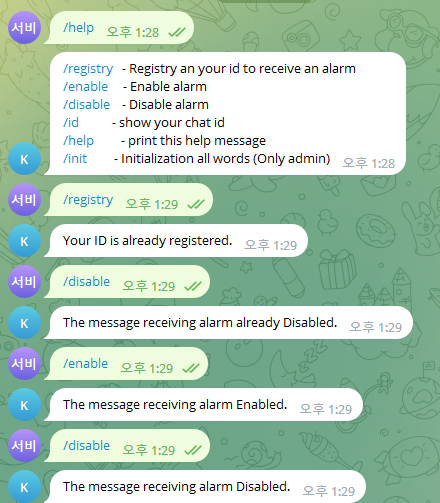
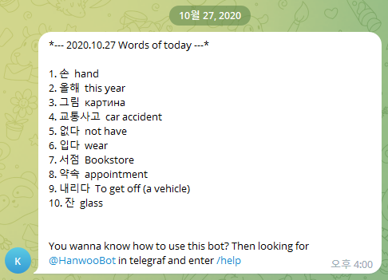

## StudyKorean 이란?
- 외국인 와이프에게 한국어 공부를 시키기 위해 텔레그램을 통해 지정된 시간에 매일 10개의 단어를 보내주는 텔레그램 메시지
- 한국 단어에 대해 러시아/영어 단어로 매칭시켜 학습 할 수 있음
  - 1,057 개의 단어를 DB 에 저장

## 기능
- 최초 텔레그램 ID를 등록하여 알람을 받을 수 있음
- 사용자 별 알람 On/Off 기능

## 설치 방법
1. daemon.py 파일과 onlykorea.py 파일을 /korea/ 폴더 아래로 이동
2. Systemd/korean.service 파일을 /usr/lib/system/systemd 로 이동 후 systemctl daemon-reload 수행
3. Crond/Crond 파일을 /var/spool/cron 에 root 라는 파일로 복사 혹은 내용을 `crontab -e` 명령어를 통해 내용 추가

## 동작 화면
   
- help 명령어를 통해 알람 On/Off 및 등록 가능   

   
- 알람 수신 시 받는 메시지 형태

## 개선 되어야 할 부분
- 전체
  - Token, Username, Password 등 config.py 으로 분리
  - 불필요한 코드 및 라이브러리 삭제
- daemon.py 
  - quiz 개발 진행 (멈춘 상태)
  - while 문 제거
- onlykorea.py
  - Crond 을 제외 후 schedule, apscheduler 등으로 자체 스케줄러 추가 필요
  
~~하지만 와이프가 한국어 수준이 높아져서 필요없어짐.. 몇년전에 이미 운영도 멈춘 상태~~
